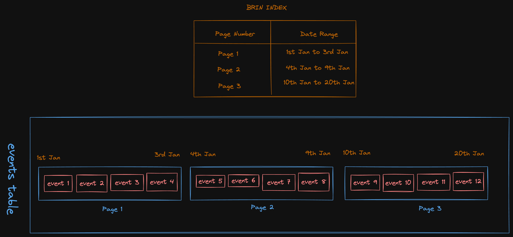

# Database Indexing

## Indexing
### 🔥 Creating index concurrently
When creating an index on a large table, it can take a long time to create the index. During this time, the table is locked and no other operations can be performed on the table. This can be a problem for large tables that are constantly being updated. This cannot be done in a production environment.

To create an index without locking the table, you can use the `CONCURRENTLY` option. This will create the index without locking the table.

```sql
CREATE INDEX CONCURRENTLY index_name ON table_name (column_name);
```

### Index Validation
We can validate if an index is valid or not using the following command:
```sql
SELECT 
    indexrelid::regclass AS index_name, 
    indrelid::regclass AS table_name, 
    indisvalid 
FROM 
    pg_index 
WHERE 
    indrelid = 'analytics.events'::regclass;
```
Here, `indisvalid` is a boolean column that tells us if the index is valid or not.

### Checking corrupted indexes
We can use the `amcheck` extension to check if an index is corrupted or not. RDS already has this extension installed. We can use the following command to check if an index is corrupted or not:
```sql
-- enable amcheck extension
SHOW rds.extensions; 

CREATE EXTENSION IF NOT EXISTS amcheck;

-- fetch the index in question
SELECT * FROM pg_indexes WHERE schemaname='analytics' AND tablename='events';

-- run bt_index_check - here 'analytics.idx_triggered_at' is the index name
SELECT bt_index_check(index => 'analytics.idx_triggered_at');
```
If the index is corrupted, you will see an error message otherwise you will see a void result.

### Reindexing
If an index is corrupted, you can reindex the index using the following command:
```sql
REINDEX INDEX CONCURRENTLY analytics.idx_triggered_at;
```

## Postgres Indexing
Postgres allows creating the following types of indexes:
1. B-tree
2. Hash
3. GiST
4. SP-GiST
5. GIN
6. BRIN

## B-tree

## BRIN
> BRIN indexes (a shorthand for Block Range INdexes) store summaries about the values stored in consecutive physical block ranges of a table. *Thus, they are most effective for columns whose values are well-correlated with the physical order of the table rows.* Example - `events` table where each row in the table is sequentially ordered naturally by the `triggered_at` column.

If you have a table where the order of the rows is correlated with the order of the values in a column, you can use a BRIN index to speed up queries on that column.

### How it works?
Data in PostgreSQL table is stored on disk in `pages` of `8KB` each. A table will have physically reside on disk as a collection of pages. These pages will have contain the actually rows of the table.


If a column (on which we want to create an index) has a natural ordering to it, we can store the minimum and maximum values of the column in each page. This way, we can skip the pages that do not contain the values we are looking for.

> When searching for a particular value, the whole page can be skipped, if the value is not within the min/max of the page. This is the core magic of BRIN.



### Advantages
1. **Size**: BRIN indexes are much smaller than B-tree indexes. Sometimes, order of magnitude smaller. This is because BRIN indexes store only the minimum and maximum values of the column in each page.
2. **Performance**: BRIN indexes are faster than B-tree indexes for large tables (millions of rows). This is because BRIN indexes are much smaller and can fit in memory.
3. **Faster Index Creation**: BRIN indexes are faster to create than B-tree indexes. This is because BRIN indexes do not need to sort the values in the column.

