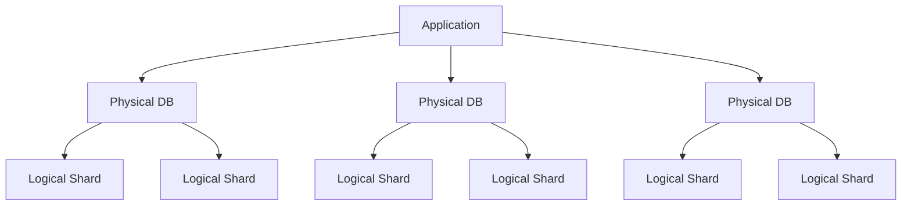

## You Don't Need to Shard Yet
### Power of PostgreSQL</spans>
| Metric                  | PostgreSQL Limit           |
| ----------------------- | -------------------------- |
| Data size               | Several terabytes          |
| Concurrent connections  | Hundreds to a few thousand |
| Transactions per second | Thousands                  |
| Query complexity        | Millions of rows           |

> [!TIP]
Don't rush into sharding! PostgreSQL can handle large datasets and high transaction volumes with the right configuration and optimization. Consider sharding only when you've exhausted other options and have a clear understanding of your data access patterns.

### Delay</spans>
Several strategies can help postpone the need for sharding:

- Vertical scaling: Upgrade to more powerful hardware.
- Read replicas: Offload read operations to replica databases.
- Caching: Implement application-level caching to reduce database load.
- Query optimization: Improve slow queries, add appropriate indexes.
- Data archiving: Move historical or less frequently accessed data to separate tables or databases.
- Table partitioning: Use PostgreSQL's built-in table partitioning feature for large tables. [Hypertables by TimescaleDB for timeseries data](https://docs.timescale.com/use-timescale/latest/hypertables/about-hypertables/) sounds something similar.
- Connection pooling: Use `pgBouncer` or similar tools to manage database connections efficiently.
- Optimize `VACUUM`: Tune `autovacuum` settings and schedule manual `VACUUM` operations during off-peak hours.
- Denormalization: Strategically denormalize data to ***reduce `JOIN` operations*** and improve query performance.
- Database tuning: Optimize PostgreSQL configuration parameters for your specific workload.
- Vertical Partitioning: Create multiple DBs and store different types of data in different DBs. Ex - User data in one DB, Order data in another DB, etc. Figma did this for a while.

---

## When to Shard?</spans>

Besides data size, consider sharding when:

- Query performance degrades: If queries are taking longer due to the volume of data.
- Write contention: When writes are causing locks and slowing down the system.
- `VACUUM` stalling: If `VACUUM` operations are taking too long or impacting performance.
- Index bloat: When indexes become too large to fit in memory.
- Backup and restore times: If these operations are taking too long for your recovery point objective (RPO) and recovery time objective (RTO).
- Geographic distribution needs: When you need data closer to geographically distributed users.
- Resource utilization: If CPU, memory, or I/O on your database server is consistently high.
- Scaling limitations: When vertical scaling (adding more resources to a single server) becomes cost-prohibitive or hits hardware limits.
- Transaction WrapAround: When you're approaching the transaction ID wraparound limit (2 billion transactions) and can't afford downtime for a `VACUUM` operation.

---
## Advantages and Disadvantages of Sharding</spans>

✅ Advantages:
- Improved scalability: Distributes data across multiple servers, allowing for handling larger datasets and higher transaction volumes.
- Better performance: Queries can run in parallel across shards, potentially reducing response times.
- Geographic distribution: Data can be located closer to users, reducing latency.
- Isolation: Issues on one shard don't necessarily affect others, improving fault tolerance.
- Cost-effective scaling: Can scale horizontally with commodity hardware instead of scaling up expensive, high-end servers.

❌ Disadvantages:
- Operational complexity: Managing multiple database instances is more complex than a single instance.
- Data distribution challenges: Choosing an effective sharding key and strategy can be difficult.
- Cross-shard operations: Queries spanning multiple shards can be slow and complex to implement.
- Cross Shard JOIN operations: JOINs across shards are often not possible or very inefficient.
- Potential data inconsistency: Maintaining consistency across shards can be challenging, especially with transactions spanning multiple shards.
- Backup and restore complexity: Managing backups and restores across multiple shards is more involved.
- Schema changes: Updating schema across all shards can be time-consuming and error-prone.
- Rebalancing data: As data grows, redistributing data across shards can be a complex operation.
- Transactions now span multiple shards, meaning Postgres can no longer be used to enforce transactionality. It is now possible that writes to one shard succeed while writes to another shard fail, leading to inconsistent data.
- Global unique ID generation for horizontally sharded primary keys.
- Distributed globally "UNIQUE" constraints.

---

## Application Sharding
Application sharding is an approach where the application logic handles the distribution of data across multiple database instances. Instead of relying on database-level sharding, the application determines which shard to read from or write to based on the data being accessed.

Key aspects of application sharding:
- The application maintains a mapping of data to shards.
- Queries are routed to the appropriate shard by the application.
- It allows for more flexible sharding strategies but puts more responsibility on the application code.
- Can be easier to implement initially but may lead to more complex application logic over time.

---

## Implementation Details
> [!IMPORTANT]

Shard only the tables that need sharding: Not all tables may need to be sharded. Identify tables that are growing rapidly or have high write volumes. Shard only the necessary tables, while preserving locality for related data.

> [!TIP] What if table A needs sharding but a related table B doesn't?

1. Denormalize: Store related data together in the same table to avoid JOINs.
2. Duplicate: Replicate data from table B to all shards of table A.
3. Query multiple shards: Fetch data from both shards and perform the JOIN in the application layer.
4. Shard table B: If the relationship is strong and JOINs are frequent, consider sharding table B as well.

Partition Key Selection: Good partition keys ensure that tuples are uniformly distributed across shards. The choice of partition key also depends on application structure, since distributed joins are expensive and ***transactionality guarantees are typically limited to a single host.***

### Logical Sharding
How many shards should we create & how to organize them? This consideration encompasses both the number of logical shards per table, and the concrete mapping between logical shards and physical hosts.

> Components:
1. Abstraction Layer: Logical sharding creates a separation between how data is logically organized and how it's physically stored.
2. Shard Key Mapping: Each piece of data is assigned to a logical shard based on a shard key, often using a hash function.
3. Logical to Physical Mapping: A separate mapping determines which physical shard (actual database server) each logical shard resides on.

> Implementation Steps:

1. Data Distribution: When inserting data, use the shard key to determine the logical shard
Use the logical-to-physical mapping to find the correct physical shard
2. Scaling: To add capacity, add new physical shards and redistribute logical shards. This process is less disruptive than redistributing individual data items
3. Rebalancing: Move logical shards between physical shards to balance load. This can be done with less data movement than traditional sharding
4. Application Design: Design your application to work with logical shard IDs. Use a centralized configuration or service discovery to maintain the logical-to-physical mapping
5. Future-Proofing: Start with more logical shards than physical shards. This allows for easier horizontal scaling in the future

### Migrating to shards
Double-write: Incoming writes get applied to both the old and new databases.

Backfill: Once double-writing has begun, migrate the old data to the new database.

Verification: Ensure the integrity of data in the new database.

Switch-over: Actually switch to the new database. This can be done incrementally, e.g. double-reads, then migrate all reads.

## Significance of Adding/Removing Shards:
### Adding Shards

* Data Migration: When adding a new shard, you need to redistribute data from existing shards to the new one. This process can be complex and time-consuming.
* Rebalancing: After adding a shard, you must rebalance data across all shards to ensure even distribution. This often involves moving large amounts of data.
* Application Updates: Your application needs to be updated to recognize and use the new shard. This might involve updating shard maps or configuration files.
* Performance Impact: During the addition process, there may be increased load on the system and potential performance degradation.
* Consistency Challenges: Ensuring data consistency during the migration and rebalancing process is crucial but can be challenging.

### Removing Shards

* Data Consolidation: Data from the shard being removed must be redistributed to remaining shards. This process needs careful planning to avoid data loss.
* Capacity Planning: Ensure the remaining shards can handle the additional load from the removed shard.
* Application Updates: Similar to adding shards, the application needs to be updated to stop using the removed shard.
* Downtime Consideration: Removing a shard might require system downtime, depending on your architecture.
* Backup Importance: It's crucial to have robust backups before removing a shard to prevent data loss.

## Excellent Resources
- [Herding elephants: Lessons learned from sharding Postgres at Notion](https://www.notion.so/blog/sharding-postgres-at-notion)
- [How Figma’s databases team lived to tell the scale](https://www.figma.com/blog/how-figmas-databases-team-lived-to-tell-the-scale/)