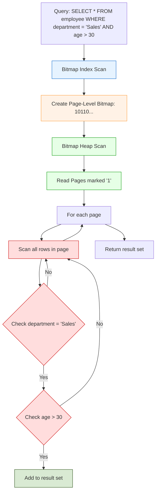
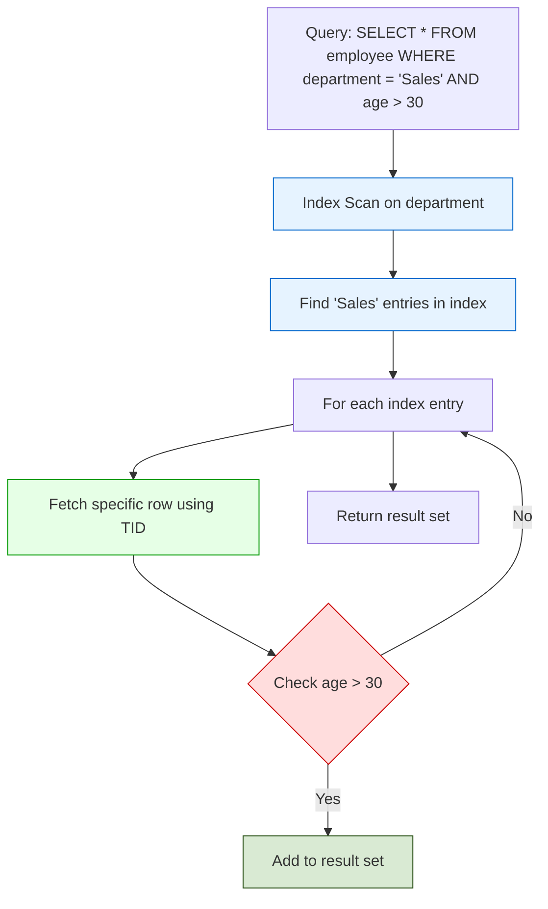

# Understanding how Postgres executes a query

## Setup
Refer to the [setup](./generate-sample-data.sql) for the initial setup.
We create an employee table with 10 million records -
1. `id` - primary key
2. `name` - varchar (100)
3. `age` - integer
4. `department` - varchar(50) - indexed
5. `location` - varchar(50) - indexed

## Query 1
```sql
EXPLAIN ANALYZE SELECT * FROM employee;
```
Output

```
"Seq Scan on employee  (cost=0.00..189184.78 rows=9999978 width=38) (actual time=0.350..689.410 rows=10000000 loops=1)"
"Planning Time: 0.141 ms"
"Execution Time: 924.669 ms"
```

1. It took 0.141 ms to plan the query.
2. It took 924.669 ms to execute the query.
3. It did a sequential scan on the table since it had to fetch all the records.
4. `(cost=0.00..189184.78 rows=9999978 width=38)`
   1. `rows=9999978` - The estimated number of rows is 9999978.
   2. `width=38` - The estimated width of the row is 38 bytes.
   3. `cost=0.00..189184.78` - The estimated cost of the query is between 0.00 and 189184.78.
5. `(actual time=0.350..689.410 rows=10000000 loops=1)`
   1. `time=0.350..689.410` - the time when the first row was fetched (0.350 ms) and the time when the last row was fetched (689 ms).
   2. rows=10000000 - The actual number of rows fetched is 10000000.
   3. loops=1 - The number of times the query was executed.


> [!NOTE]
> `cost=0.00..189184.78` - It represents arbitrary cost units used by the PostgreSQL query planner. The costs are primarily used by the query planner to compare different execution plans, not to predict actual execution time.
> * 0.00 is the startup cost: the estimated cost to return the first row.
> * 10507.92 is the total cost: the estimated cost to return all rows.
> 
> These costs are calculated based on several factors:
> 1. Sequential and random page access costs (which can be configured)
> 2. CPU processing time for each row
> 3. Disk I/O


## Query 2
```sql
EXPLAIN ANALYZE SELECT * FROM employee WHERE department = 'Sales' AND age > 30;
```

Output

```
"Bitmap Heap Scan on employee  (cost=10694.38..200195.33 rows=745840 width=38) (actual time=134.582..848.540 rows=759358 loops=1)"
"  Recheck Cond: ((department)::text = 'Sales'::text)"
"  Rows Removed by Index Recheck: 3333417"
"  Filter: (age > 30)"
"  Rows Removed by Filter: 239617"
"  Heap Blocks: exact=56159 lossy=33025"
"  ->  Bitmap Index Scan on idx_department  (cost=0.00..10507.92 rows=984998 width=0) (actual time=128.465..128.465 rows=998975 loops=1)"
"        Index Cond: ((department)::text = 'Sales'::text)"
"Planning Time: 1.934 ms"
"Execution Time: 866.209 ms"
```

#### Planning and Execution Times:
```
"Planning Time: 1.934 ms"
"Execution Time: 866.209 ms"
```
* Planning Time (1.934 ms): Time taken to parse the SQL and generate the execution plan.
* Execution Time (866.209 ms): Total time to run the query, including all operations.

#### Bitmap Index Scan:
```
"  ->  Bitmap Index Scan on idx_department  (cost=0.00..10507.92 rows=984998 width=0) (actual time=128.465..128.465 rows=998975 loops=1)"
"        Index Cond: ((department)::text = 'Sales'::text)"
```
* This operation scans the index on the 'department' column and creates a bitmap of matching row locations.
* Estimated cost: 0.00 (start-up) to 10507.92 (total) units.
* Actual time: 128.465 ms.
* Rows fetched: 998975.
* The index condition is `(department)::text = 'Sales'::text`.

🔥 Key points:

The start time (128.465 ms) is not zero primarily because
* Time to perform the entire index scan operation
* Time to create and populate the in-memory bitmap
* The end time is the same as the start time because this operation completes entirely before moving to the next stage.

#### Bitmap Index Scan & Bitmap Heap Scan:

`Bitmap Index Scan:`
Creates a memory bitmap where each bit represents a table page potentially containing matching rows, based on the index (e.g., 'department'). It's fast as it only reads the index, not the table data.

`Bitmap Heap Scan:`
Uses the bitmap to fetch relevant table pages and retrieve matching rows. It then:
1. Rechecks the index condition (e.g., 'department = Sales') because the bitmap can be "lossy" for efficiency, potentially marking some pages that don't have matches.
2. Applies additional filters (e.g., 'age > 30') that weren't part of the index.

This two-step process is efficient for queries returning a moderate number of rows because:
- It reduces random I/O by optimizing the order of page reads.
- It allows combining an index condition with additional filters.
- It balances between the speed of index scans and the thoroughness of sequential scans.

The "Rows Removed by Index Recheck" and "Rows Removed by Filter" in the EXPLAIN output show how many rows were eliminated at each step, helping to understand the query's efficiency.

## Bitmap Index Scan (Page Level) vs Index Scan

***Bitmap Index Scan***


***Index Scan***


| Aspect              | Index Scan                                                        | Bitmap Scan                                                      |
| ------------------- | ----------------------------------------------------------------- | ---------------------------------------------------------------- |
| Data Access         | Direct access to specific rows using TID (Tuple Identifier)       | Accesses entire pages marked in the bitmap                       |
| I/O Pattern         | Can lead to random I/O, especially if matching rows are scattered | Optimizes I/O by reading pages in an efficient order             |
| Memory Usage        | Keeps index scan active throughout execution                      | Creates a compact in-memory bitmap                               |
| Row Checking        | Checks only the specific rows pointed to by the index             | Checks all rows in the selected pages                            |
| Multiple Conditions | Less efficient for combining multiple indexes                     | Can efficiently combine multiple indexes using bitmap operations |
| Selectivity         | Efficient for high selectivity (small number of rows)             | Efficient for moderate selectivity                               |
| Rechecking          | Minimal rechecking, only for non-indexed conditions               | Rechecks all conditions for all rows in selected pages           |
| Scalability         | Can become inefficient for larger result sets due to random I/O   | Scales better for larger result sets within a certain range      |

Key Differences:
1. Row vs Page Level: Index Scan operates at the row level, while Bitmap Scan operates at the page level.
2. I/O Efficiency: Bitmap Scan can be more I/O efficient for larger result sets by optimizing page reads.
3. Flexibility: Bitmap Scan is more flexible for complex conditions involving multiple indexes.
4. Trade-offs: Bitmap Scan reads more rows than necessary but can reduce overall I/O; Index Scan is more precise but can lead to more random I/O.

## Bitmap Index Scan (Page Level) vs Bitmap Index Scan (Row Level)

```mermaid
graph TD
    subgraph "Page-Level Bitmap Scan"
    A1[Query] --> B1[Bitmap Index Scan]
    B1 --> C1[Create Page-Level Bitmap: 10110...]
    C1 --> D1[Bitmap Heap Scan]
    D1 --> E1[Read Pages marked '1']
    E1 --> F1[Scan all rows in each page]
    F1 --> G1[Apply all conditions]
    G1 --> H1[Return matching rows]
    end

    subgraph "Row-Level Bitmap Scan"
    A2[Query] --> B2[Bitmap Index Scan]
    B2 --> C2[Create Row-Level Bitmap: 1001001...]
    C2 --> D2[Bitmap Heap Scan]
    D2 --> E2[Fetch specific rows marked '1']
    E2 --> F2[Apply non-indexed conditions]
    F2 --> G2[Return matching rows]
    end

    style C1 fill:#fff2e6,stroke:#ff9933
    style C2 fill:#e6f3ff,stroke:#0066cc
    style E1 fill:#e6ffe6,stroke:#009900
    style E2 fill:#e6ffe6,stroke:#009900
    style G1 fill:#ffdddd,stroke:#cc0000
    style F2 fill:#ffdddd,stroke:#cc0000
```




| Aspect                       | Page-Level Bitmap Scan                      | Row-Level Bitmap Scan              |
| ---------------------------- | ------------------------------------------- | ---------------------------------- |
| Bitmap representation        | Each bit represents a page                  | Each bit represents a row          |
| Memory usage                 | Lower (fewer bits needed)                   | Higher (one bit per row)           |
| Precision                    | Lower (may read unnecessary rows)           | Higher (pinpoints exact rows)      |
| I/O pattern                  | Reads entire pages                          | Can lead to more scattered reads   |
| Rechecking needed            | Yes, must check all rows in selected pages  | Minimal, knows exact matching rows |
| Best for                     | Queries returning a moderate number of rows | Queries with high selectivity      |
| Combining multiple indexes   | Very efficient, low memory overhead         | Efficient, but higher memory usage |
| Scalability for large tables | Better due to lower memory requirements     | May become memory-intensive        |

Key Differences:
1. Granularity: Page-level operates on entire pages, while row-level targets specific rows.
2. Memory Efficiency: Page-level uses less memory but may process unnecessary rows.
3. Precision: Row-level is more precise but potentially at the cost of more fragmented I/O.
4. Rechecking: Page-level requires more rechecking of conditions, row-level minimizes this.

Page-Level Bitmap Scan is preferred when:
1. Memory is constrained: It uses less memory, especially for large tables.
2. Query has low to moderate selectivity: When a significant portion of the table is expected to match.
3. Data is well-clustered: Matching rows are likely to be on the same pages.
4. Multiple indexes need to be combined: It's more memory-efficient for complex conditions.
5. Table is very large: Scales better for extremely large datasets.

Row-Level Bitmap Scan is preferred when:
1. Query has high selectivity: When only a small fraction of rows are expected to match.
2. Precise row access is crucial: To minimize unnecessary data reads.
3. Sufficient memory is available: Can afford the higher memory usage for better precision.
4. Data is scattered: Matching rows are distributed across many pages.
5. Minimal rechecking is desired: To reduce CPU overhead from rechecking conditions.

PostgreSQL's query planner considers these factors, along with statistics about the data distribution and system resources, to choose the most appropriate scan method. In some cases, it might even start with a page-level bitmap and refine it to a row-level bitmap for certain portions of the data, combining the benefits of both approaches.

> [!IMPORTANT]
> 🔥 The line `Heap Blocks: exact=56159 lossy=33025"` indicates that PostgreSQL used a hybrid approach, combining both row-level (exact) and page-level (lossy) bitmap scans in the same query execution.
* Exact blocks (56,159): These correspond to a row-level bitmap scan. The database knows exactly which rows in these blocks match the index condition.
* Lossy blocks (33,025): These correspond to a page-level bitmap scan. For these blocks, the database only knows that there might be matching rows, but it needs to check all rows in the block to be sure.

Excellent Video - [DB2 — Chapter #09 — Video #39 — Bitmap Index/Heap Scan, row- and page-level bitmaps](https://www.youtube.com/watch?v=UXKYAZOWDgk)


## Query 3
```sql
EXPLAIN ANALYZE SELECT * FROM employee ORDER BY name;
```
Remember that we do not have an index on the `name` column.

```
"Gather Merge  (cost=817856.21..1790144.30 rows=8333316 width=38) (actual time=7659.775..8849.909 rows=10000000 loops=1)"
"  Workers Planned: 2"
"  Workers Launched: 2"
"  ->  Sort  (cost=816856.19..827272.83 rows=4166658 width=38) (actual time=7581.931..7819.111 rows=3333333 loops=3)"
"        Sort Key: name"
"        Sort Method: external merge  Disk: 167032kB"
"        Worker 0:  Sort Method: external merge  Disk: 167648kB"
"        Worker 1:  Sort Method: external merge  Disk: 165488kB"
"        ->  Parallel Seq Scan on employee  (cost=0.00..130851.58 rows=4166658 width=38) (actual time=0.028..278.241 rows=3333333 loops=3)"
"Planning Time: 0.408 ms"
"Execution Time: 9075.584 ms"
```

1. Parallel Sequential Scan:
```
"        ->  Parallel Seq Scan on employee  (cost=0.00..130851.58 rows=4166658 width=38) (actual time=0.028..278.241 rows=3333333 loops=3)"
```
- This is the base operation: a parallel full table scan on the employee table.
- Each of the 3 processes (1 leader + 2 workers) scanned about 3,333,333 rows. Check `SHOW max_parallel_workers_per_gather` to see the number of workers.
- It took about 278ms to scan the data.

2. Sort Operation:
```
"  ->  Sort  (cost=816856.19..827272.83 rows=4166658 width=38) (actual time=7581.931..7819.111 rows=3333333 loops=3)"
"        Sort Key: name"
"        Sort Method: external merge  Disk: 167032kB"
"        Worker 0:  Sort Method: external merge  Disk: 167648kB"
"        Worker 1:  Sort Method: external merge  Disk: 165488kB"
```
- After scanning, each process sorted its portion of the data.
- The sort was done using ***external merge sort, indicating it didn't fit in memory.***
- 🔥 Each process used about 165-167 MB of disk space for sorting.
- The sort operation took the bulk of the time, about 7.5 seconds (7819.111 - 278.241).

3. Gather Merge:
```
"Gather Merge  (cost=817856.21..1790144.30 rows=8333316 width=38) (actual time=7659.775..8849.909 rows=10000000 loops=1)"
"  Workers Planned: 2"
"  Workers Launched: 2"
```
- This is the final step that combines the sorted results from all processes.
- It preserves the sorted order while merging.
- Two worker processes were planned and launched successfully.
- The entire operation, including gathering and merging, took about 8.85 seconds.
- Note that the start time (7649.775 ms) is lower than the end time of the previous sort step (7819.111 ms). This is because the gather operation started as soon as one of the workers finished sorting, not after all workers completed sorting.

4. Overall Timings:
 ```
 "Planning Time: 0.408 ms"
 "Execution Time: 9075.584 ms"
 ```
 - Query planning was very quick (0.408 ms).
 - Total execution time was about 9.1 seconds.

Key Observations:
1. The query leveraged parallelism effectively, distributing the work across 3 processes.
2. The sort operation was the most time-consuming part, requiring external merge sort.
3. Despite parallelism, the query took significant time due to the large data volume and disk-based sorting.
4. The actual number of rows (10,000,000) was higher than estimated (8,333,316), which could impact performance predictions.

Potential Optimizations:
- Increase `work_mem` to allow more in-memory sorting.
- Consider adding an index on the 'name' column if this query is frequent.
- If hardware allows, increase `max_parallel_workers_per_gather` for more parallelism.